# The FitFuel Depot

<h2 class="center">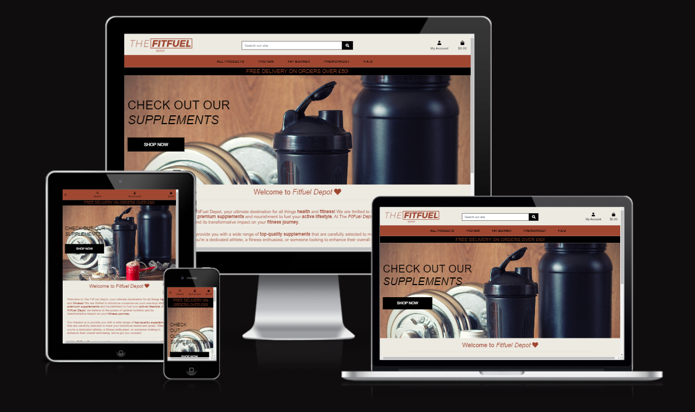

### **Live Site**
[The FitFuel Depot Live Site](https://fitfuel-depot.herokuapp.com/)

### **Repository:**
[The FitFuel Repository](https://github.com/Kierandoolan/The-FitFuel-Depot)

## Contents 

- [User Experience (UX)](#user-experience-ux)
   * [User Stories](#user-stories)
   
- [Design](#design)
   * [Colour Scheme](#colour-scheme)
   * [Typography](#typography)
   * [Imagery](#imagery)
   * [Wireframes](#wireframes)
   * [Database Schema](#database-schema)

- [Features](#features)

- [Technologies](#technologies)
   * [Languages used](#languages-used)
   * [Libraries & Programs Used](#libraries-and-programs-used)

- [Testing](#testing)
  
- [Deployment](#deployment)
   

- [Credits](#credits)
   * [Code](#code)

## User Experience (UX)
A User of The FitFuel Depot Page would be someone who is looking to add supplements to their goals. It could also be for someone who has an interest in learning about these type of supplements by reading the product detail.

## User Stories 
# User Stories

Please find my Kanban Board with my user stories [here](https://github.com/SamanthaBooth81/clay_and_fire/projects/1). Below is a detailed list of User Stories per User Type.
## Superuser / Admin
1. As a Admin I can Create a new product so that I can increase the products I have for sale on the site
2. As a Admin I can Update a products details so that I can adjust the product information
3. As an admin I can Delete a product so that I can change the products I have for sale on the site and if they are no longer available

## Consumer
1. As a new user I can easily register for the website so that I can purchase products quickly and easily
2. As a returning user I can log into the site with my login details so that I can access see my profile and previous orders
3. As a logged in user I can logout of the site easily so that my account is secure
4. As a user I can browse through all the products so that I can choose which one which ones I may want to purchase
5. As a user I can select a product and view it in detail so that I can see more information that may help me to purchase
6. As a user I can filter the products so that so that I can view products by category and price
7. As a user I can search the site for products so that I can be directed straight to it easily saving me time scrolling through products
8. As a user I can see reviews and ratings of a product so that I can see other customer opinions on it to help me make up my mind
9. As a logged in user I can leave a product review once purchased so that I can share my experience with other customers
10. As a customer I can add a product to the shopping basket so that I can purchase it
11. As a customer I can adjust the quantity of items in my bag so that I can order more or less of an item
12. As a customer I can remove an item from my bag so that I am not charged for it
13. As a customer I can see the total of my basket so that I know how much I have spent
14. As a customer I can checkout securely so that I am notified the purchase has been successful
15. As a logged in user I can add or remove a product to my favourites so that it is quick and easy to purchase the item again
16. As a logged in user I can view my profile so that I can add default address and view orders
17. As a user I can signup to the newsletter so that I receive news and discounts from the site
18. As a user I can see the sites FAQ's so that I may get some answers to my questions easily
19. As a user I can view the sites policy so that I understand how my data will be used
20. As a user I can follow the business on social media so that I can keep up to date with latest news and offers

#### User stories not yet implemented
 write later

## Business Model

- A traditional B2C (Business to Customer) application has been chosen, with a straightforward and user-friendly responsive interface.

- This online store offers supplements to the customer.

## Marketing

- This site has a Facebook Business Page with a link on the page footer. It can be viewed here:
[The FitFuel Depot](https://www.facebook.com/thefitfueldepot/)

- Users can subscribe to our newsletter to receive all offers in their email box. Subscription links are available on the footer on all pages. 

- Upon registering, the user is redirected to a new page confirming their subscription. The site owner can now see the new subscriber on their audience dashboard, and new campaigns will be sent to them too.

- I have searched similar websites and google for good key words to apply to the site for SEO purposes:

1. Fitness
2. Supplements
3. Protein
4. Muscle
5. Fatloss
6. Energy

- I have used the meta description and keywords to improve the SEO

## Design

  The Design was to make it attractive for users of the site and to make it easy on the eye. 

### Colour Scheme
<h2 class="center"><h2 class="center">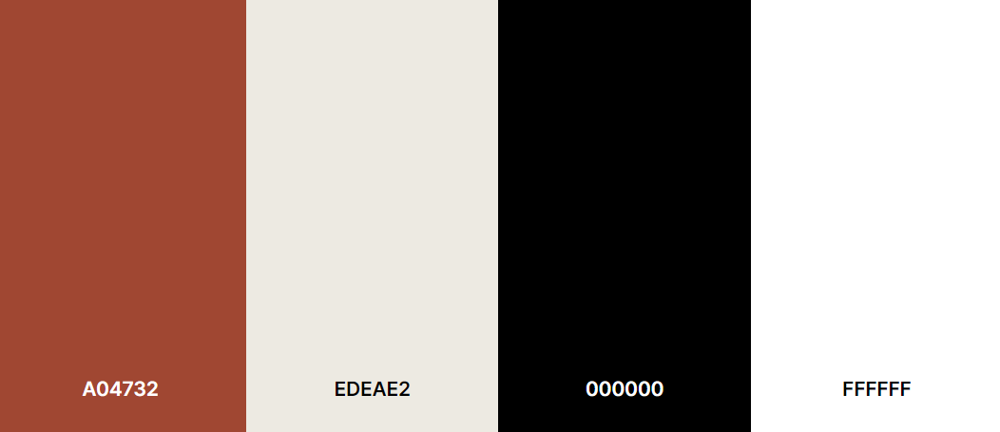</h2>

- I got these four simple colours from the website called [coolors](coolors.co)
- #A04732. This was for the writing of the website.
- #EDEAE2. This was for the background of the website.
- #000000. This was for buttons and the banner. 
- #FFFFFF. This was for product cards to make it easy to read.

### Typography
-  ''Work Sans', Is my main font. I believe it to be attractive for the page.
- 'sans-serif' was chosen as fallback font.

### Imagery
- The Logo, Hero Pic and also the FAQ is the only static images displayed on the website. All other images was uploaded onto my AWS Bucket that 
i will explain futher down.

### Wireframes
-   To View Home DeskTop click [here](readme_images/home-desktop.png).
-   To View Home Ipad and Iphone click [here](readme_images/home-ipad-iphone.png).
-   To View Product Page Desktop click [here](readme_images/product-desktop.png).
-   To View Product Page Ipad and Iphone click [here](readme_images/product-page-iphone-ipad.png).
-   To View Product Detail Desktop click [here](readme_images/product-desktop.png).
-   To View Product Detail Ipad and Iphone click [here](readme_images/product-detail-ipad-iphone.png).
-   To View Checkout Page Desktop click [here](readme_images/checkout-desktop.png).
-   To View Checkout Page Ipad and Iphone click [here](readme_images/checkout-ipad-iphone.png).

## Database Schema 

<h2 class="center"></h2>

- I used principles of Object-Oriented Programming throughout this project and Django’s Class-Based Generic Views.

- Django AllAuth was used for the user authentication system.

- The Three Custom Models Used are 

# Features

## Homepage

### Logo

<h2 class="center"> </h2>

### Search Bar 

<h2 class="center">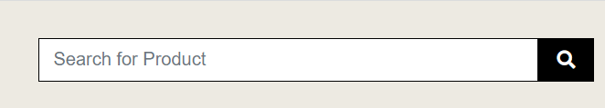 </h2>

### My Account 

<h2 class="center">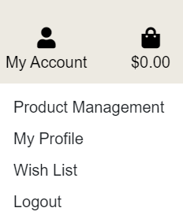 </h2>

### Shopping Bag 

<h2 class="center"> </h2>

### Bootstrap Toast

<h2 class="center">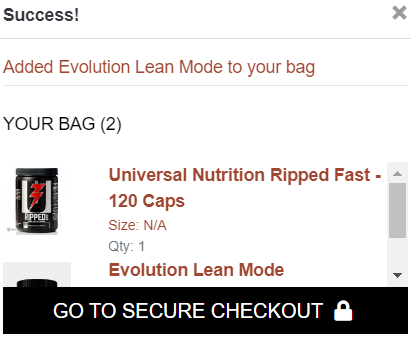 </h2>

### Product Navigation with Banner

<h2 class="center">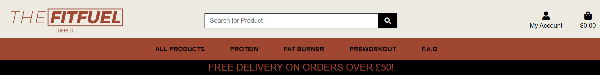 </h2>

### Hero Picture

<h2 class="center"></h2>

### Welcome Message

## My Account

### Account Registration

<h2 class="center">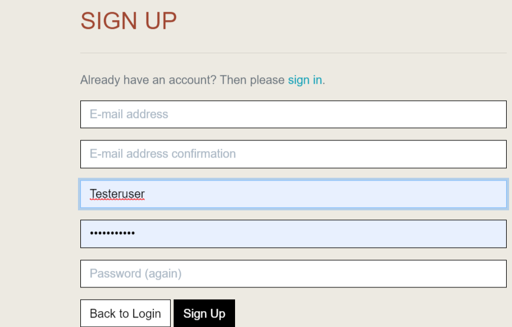 </h2>

### Login

<h2 class="center">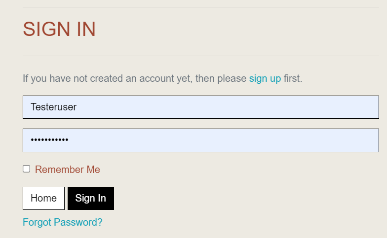 </h2>

### My Profile

- Delivery Information and Order History

<h2 class="center">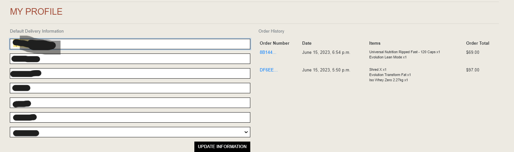 </h2>

-Checkout Complete

<h2 class="center">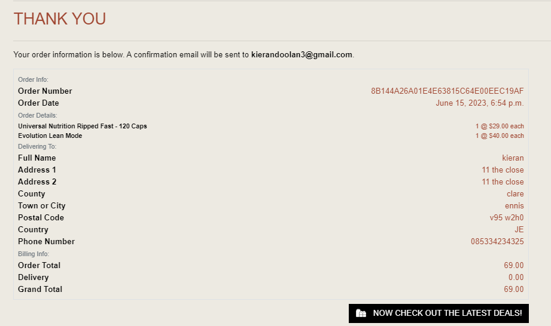 </h2>

### Logout

<h2 class="center">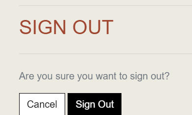 </h2>

## Products Page 

<h2 class="center">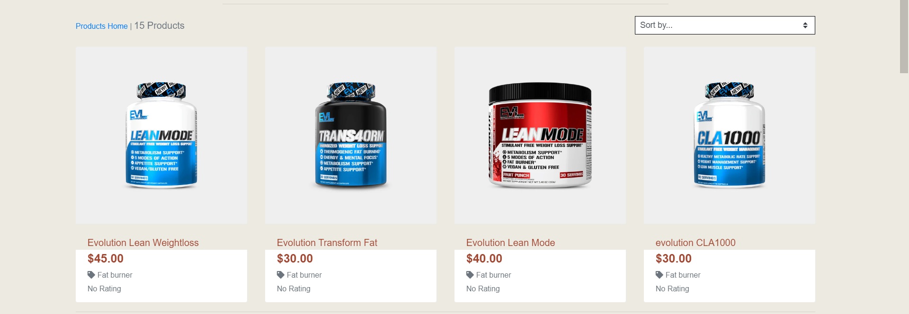</h2>

## Product Details 

<h2 class="center">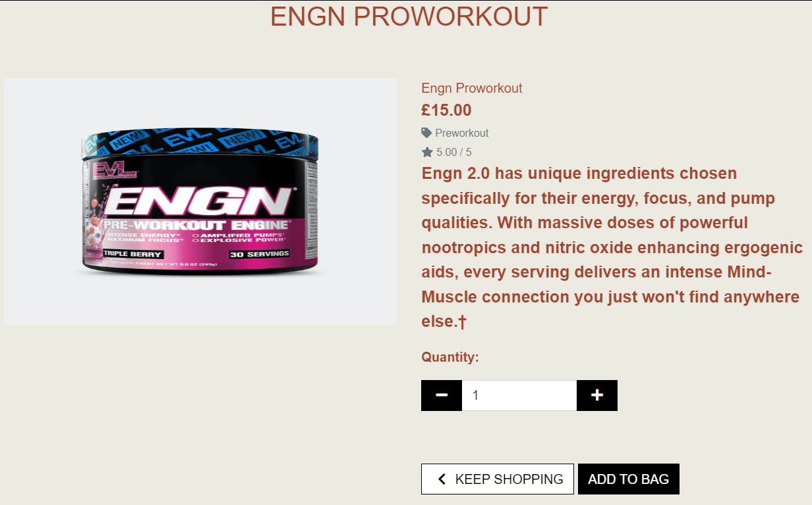</h2>

## Wishlist

<h2 class="center">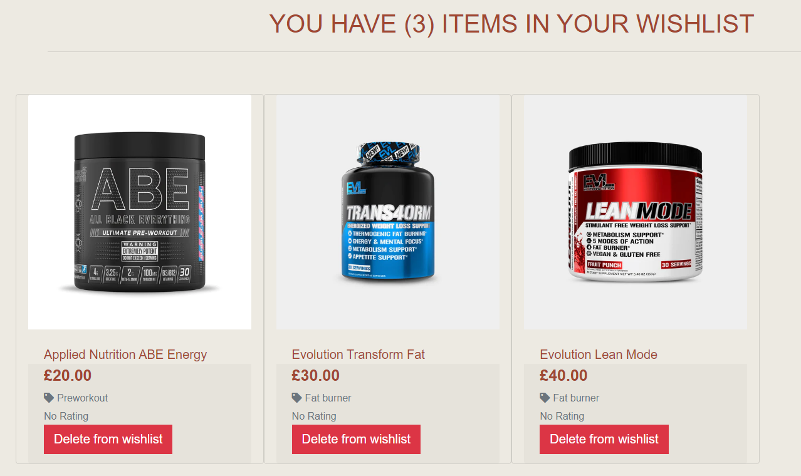 </h2>

## Product Review

<h2 class="center"></h2>

## Review Form

<h2 class="center"></h2>

## Edit Review Form

<h2 class="center">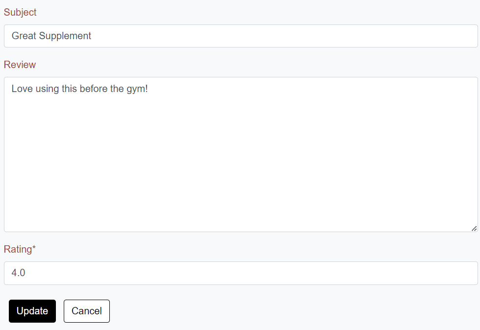</h2>

## Delete Review Confirmation

<h2 class="center">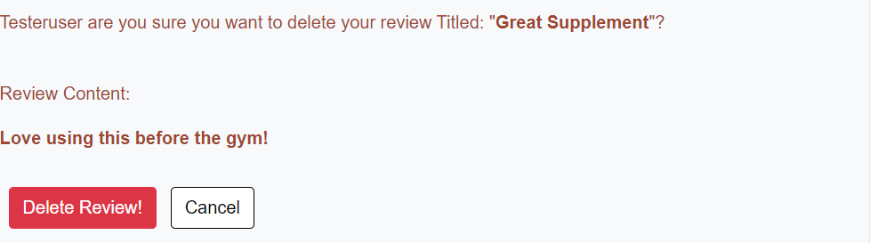 </h2>

## Favourited Products (Wishlist)

<h2 class="center"></h2>

## Shopping Bag

<h2 class="center">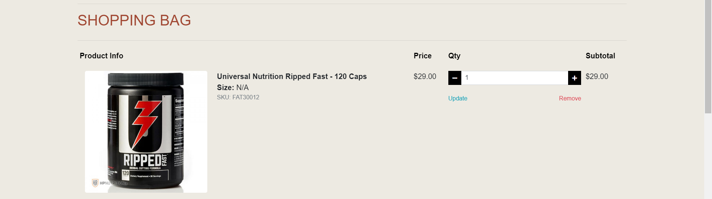 </h2>

## Checkout

<h2 class="center">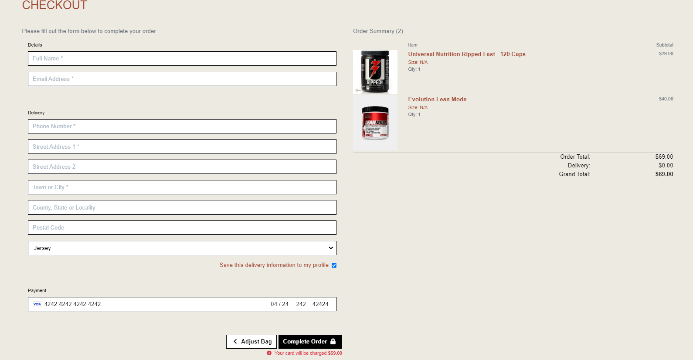 </h2>

## Checkout Success

<h2 class="center"> </h2>

## Footer

<h2 class="center">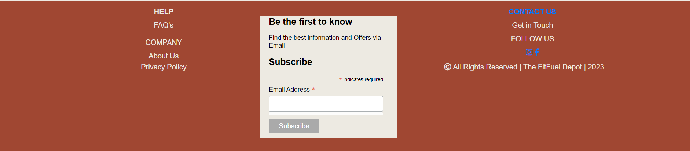</h2>

## Help

### FAQs

<h2 class="center">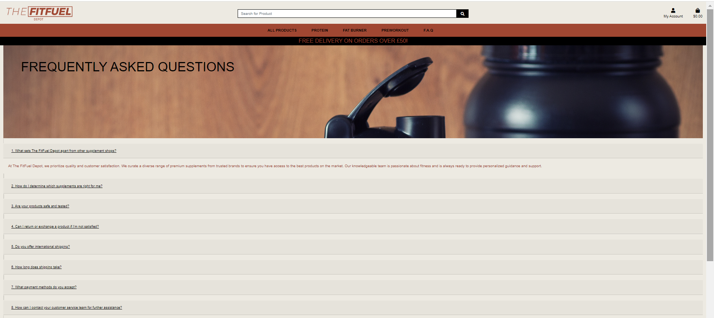 </h2>

## Company
### About Us

<h2 class="center">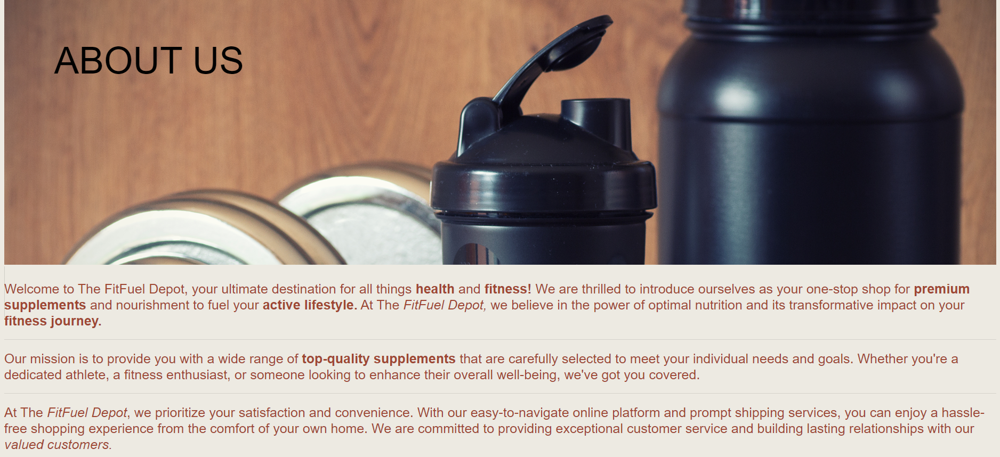 </h2>

### Privacy Policy

<h2 class="center">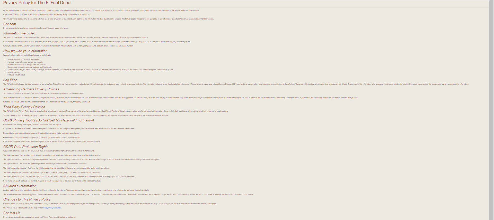 </h2>

## 404 Error Page

<h2 class="center"> </h2>
Fix Errror

## Admin Features

### Product Management
<h2 class="center">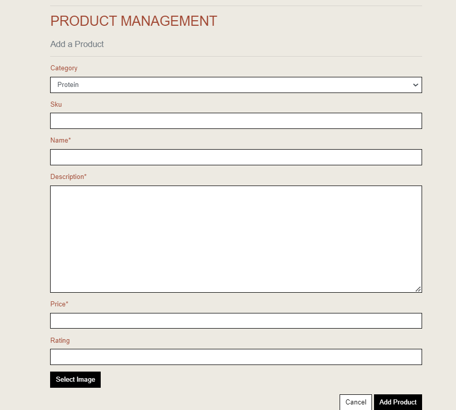 </h2>

### Edit Products
<h2 class="center">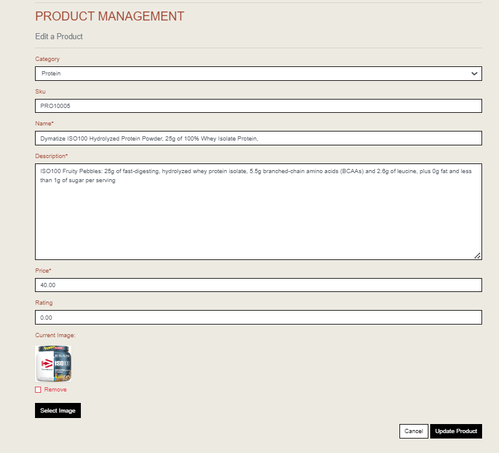 </h2>

### Features to Add in the Future. 

## Technologies

### Languages used

- [HTML5](https://en.wikipedia.org/wiki/HTML5)
- [CSS3](https://en.wikipedia.org/wiki/Cascading_Style_Sheets)
- [Javascript](https://en.wikipedia.org/wiki/JavaScript)
- [Python](https://www.python.org/)

### Libraries and Programs Used

- [Git](https://git-scm.com/)
    - Version control.
- [GitHub](https://github.com/)
    - For storing code and deploying the site.
- [Gitpod](https://www.gitpod.io/)
    - Used for building and editing my code.
- [Django](https://www.djangoproject.com/)
    - A python based framework that was used to develop the site.
- [Django-allauth](https://django-allauth.readthedocs.io/en/latest/installation.html)
    - A authentication library used to create the user accounts
- [Bulma](https://bulma.io/) 
    - To style the icons throughout the project.
- [AWS S3 Buckets](https://aws.amazon.com/s3/)
	- AWS S3 Buckets provides the storage for the deployed sites static and Media files.
- [Google Fonts](https://fonts.google.com/)
    - Used for getting fonts.
- [Am I Responsive](http://ami.responsivedesign.is/#)
    - Multi Device Website Mockup Generator was used to create the Mock up image in this README
- [Bootstrap](https://getbootstrap.com/)
    - For help designing the html templates.
- [Font Awesome](https://fontawesome.com/)
    - Used to obtain the icons used.
- [Google Developer Tools](https://developers.google.com/web/tools/chrome-devtools)
    - Used to help fix problem areas and identify bugs.
- [Cloudinary](https://cloudinary.com/)
    - Used to store static files and images.
- [Favicon.io](https://favicon.io/)
    - Used to generate the site's favicon.
- [PostgreSQL](https://www.postgresql.org/)
    - Database used through heroku.
- [Coolors](https://coolors.co/) -
    - Used for colour palette
- [Lucidchart](https://lucid.app/)
    - Used for Data Schema
- [Balsamiq](https://balsamiq.com/)
    - To create the wireframes.
- [W3C Markup Validation Service](https://validator.w3.org/) 
    - Used to validate HTML code.
- [W3C CSS Validation Service](https://jigsaw.w3.org/css-validator/#validate_by_input)
    - Used to validate CSS code.
- [PEP8CI](https://pep8ci.herokuapp.com/)
    - Used to validate Python code.
- [JSHint](https://jshint.com/)
    - Used to validate JS code.
- [Crispy Forms](https://django-crispy-forms.readthedocs.io)
    - Used for forms.
- [Heroku](https://www.heroku.com/)
    - To deploy the project.

### Database Security
I used an env.py file to protect all sensitive information.

Cross-Site Request Forgery (CSRF) tokens were used on all forms throughout this site.
## Testing 
This Project was tested manually.

Testing and results can be found [here](/TESTING.md)

# Deployment

This project was deployed using Heroku. At the time of deployment, Heroku was facing a security issue, therefore this project was deployed via the command line in GitPod and those are the steps detailed below. As this was the case I was unable to allow automatic deployments in Heroku each time a commit was pushed into the repository.

See the following steps to deploy below:

1. Log into Heroku and Create a New App.

2. Give the App a name, it must be unique, and select a region closest to you. 

3. Click on 'Create App'. This will take you to a page where you can deploy your project. 

4. Next, click on the 'Resources' tab and search for 'Heroku Postgres' in the Add-ons section to add the Heroku Postgres database to the project. 

5. Click on the 'Settings' tab at the top of the page. The following steps must be completed before deployment.

6. Within the settings.py file you need to import os and import dj_database_url at the top. Then, in the command line install dj_database_url and psycopg2 so that we can use Postgres. Freeze these installs into the requirements.txt file.

7. Scroll down to Config Vars (also known as Environment Variables) and click 'Reveal Config Vars'. Here the database URL is stored to run my app on Heroku. 

I used an if statement in settings.py (see below) so that when our app is running in Heroku, we connect to Postgres but in our local environment, we connect to sequel light:

    development = os.environ.get('DEVELOPMENT', False)

    if development:

            DATABASES = {
                'default': {
                    'ENGINE': 'django.db.backends.sqlite3',
                    'NAME': BASE_DIR / 'db.sqlite3',
                }
            }

        else:

            DATABASES = {
                'default': dj_database_url.parse(os.environ.get('DATABASE_URL'))
            }

Development is set in gitpod's environment variables as True.

8. Next I ran the migrations again to set up my Postgres Database by running **Python 3 manage.py migrate** within the command line and then create a Superuser using **python3 manage.py create superuser**.

9. Following setting up the database I generated a new Secret Key, to replace the insecure key that was in settings.py and added: **os.environ.get('SECRET_KEY')**. I then added the newly generated key to the Config Vars on Heroku. 

10. We must then install Gunicorn, which will act as our webserver and freeze that into our requirements file.

11. Next, I created a Procfile to tell Heroku to create a web dyno that will run Gunicorn and serve our Django app.

Within this file add the following:

    web: gunicorn fitfuel.wsgi

Web tells Heroku to allow web traffic, whilst Gunicorn is the server installed earlier, a web services gateway interface server (wsgi). This is a standard that allows Python services to integrate with web servers.

12. I then told Heroku temporarily disable collectstatic by using the Heroku config set, disable collectstatic = 1. I added this via Heroku's Config Vars but this can also be added via the command line. This was to prevent Heroku from attempting to deploy the static files, causing an error, until Amazon Web Services was set up. 

13. Then add the hostname of our Heroku app to 'Allowed Hosts' in settings.py as well as localhost so that GitPod will still work too.

14. I then committed and pushed these changes into my GitHub repository so that I could start my first deployment. Once complete, log into Heroku using the following command in the terminal, **heroku login -i**,  and enter your login details.

15. Once logged in, add a remote to your local repository with the Heroku git:remote command and your Heroku app’s name: **heroku git:remote -a fitfuel-depot**

16. Finally, deploy using the following command: **git push heroku main**. Once deployed you can open the app from the command line to ensure it was successfully deployed.

17. Once we can confirm the app deployed successfully, we need to set up Amazon Web Services as this will be where my media and static files are stored. To do this I first created an account with Amazon Web Services. Then, I searched for the service, S3, using the search bar at the top of the page. 

18. Click into it and then click the orange 'Create a Bucket' button. I named this bucked to match my fitfuel-depot Heroku app name to keep things simple. Then, I selected my region and changed the 'Object Ownership' setting to **ACLs enabled**. Then, I unchecked block all public access, acknowledged that the bucket will be public, and clicked on the 'Create Bucket' button.

19. Next, on the properties tab, I scrolled to the bottom and turned on static website hosting.
This gave me a new endpoint that I can use to access it from the internet. For the index and error document, I filled in some default values and then clicked Save.

20. Now on the permissions tab I pasted in the following coors configuration:

    [
        
        {
            "AllowedHeaders": [
            "Authorization"
            ],

            "AllowedMethods": [
            "GET"
            ],

            "AllowedOrigins": [
            "*"
            ],

            "ExposeHeaders": []
        }
        
    ]

which is going to set up the required access between our Heroku app and this s3 bucket.

21. Next I'll go to the bucket policy tab a select, policy generator so we can create a security policy for this bucket. The policy type is going to be s3 bucket policy and then allow all principals by using a '*' and the action will be, get object. Next, I copied the ARN which stands for Amazon resource Name from the other tab and paste it into the ARN box at the bottom. I then clicked 'Add statement' and then 'Generate Policy'.

22. I then copied this policy into the bucket policy editor. I then added '/*' at the end of the resource key to allow access to all resources in this bucket and then saved it.

23. Finally, to complete configuration, I went to the 'access control list' tab and checked edit and enable List for Everyone (public access), and accepted the warning box.

24. Next I created a group and a user to access the bucket by searching for the service IAM (Identify and Access Management). I clicked on 'User Groups' and then 'Create User Group' giving it the name 'fitfuel-depot-mangage'. 

25. I then created the Policy used to access our bucket by clicking 'Policies' and then 'Create Policy'. I clicked onto the JSON tab and then selected import managed policy to import one that AWS has pre-built for full access to s3.

26. I searched for s3 and then import the s3 full access policy. I then got the bucket ARN from the bucket policy page in s3 and pasted that into the 'Resource' section on the JSON tab.

I then clicked the 'Next' buttons until I reached 'Review Policy'. I gave it a name and a description and then clicked 'Create Policy'. This took me back to the policies page.

27. Next I attached the policy to the Group I created by returning to the Create User Group page and refreshing the Policies box. I then was able to attach the new policy created by selecting it and finally clicking 'Create Group'.

28. Finally I created a user to put in the group by going to the User's page and clicking 'Add User'. I created a user named **fitfuel-staticfiles-user**, gave them Programmatic Access, and clicked 'Create User'. 

29. I then downloaded the CSV file which contained this User's Access Key and Secret Access Key which I used to authenticate them from my Django app. It is important to download this file as you cannot be re-downloaded and contains the new user's credentials which I next add to the Config Vars on Heroku.

30. Next, I connected Django to the new S3 bucket. To do this I installed two new packages:
- boto3
- django-storages 

31. I then pip3 freeze these to the requirements.txt file to ensure they're installed on the next Heroku Deploy and added **storages** to our installed apps in settings.py. 

32. To connect Django to S3 (only on Heroku) I then added the following in if statement settings.py:

        if 'USE_AWS' in os.environ:
            # Bucket Config
            AWS_STORAGE_BUCKET_NAME = 'fitfuel-depot'
            AWS_S3_REGION_NAME = 'eu-west-2'
            AWS_ACCESS_KEY_ID = os.environ.get('AWS_ACCESS_KEY_ID')
            AWS_SECRET_ACCESS_KEY = os.environ.get('AWS_SECRET_ACCESS_KEY')
            AWS_S3_CUSTOM_DOMAIN = f'{AWS_STORAGE_BUCKET_NAME}.s3.amazonaws.com'

            # Static and media files
            STATICFILES_STORAGE = 'custom_storages.StaticStorage'
            STATICFILES_LOCATION = 'static'
            DEFAULT_FILE_STORAGE = 'custom_storages.MediaStorage'
            MEDIAFILES_LOCATION = 'media'

            # Override static and media URLs in production
            STATIC_URL = f'https://{AWS_S3_CUSTOM_DOMAIN}/{STATICFILES_LOCATION}/'
            MEDIA_URL = f'https://{AWS_S3_CUSTOM_DOMAIN}/{MEDIAFILES_LOCATION}/'

33. I then added the following to our Config Vars on Heroku:
- USE_AWS = True
- AWS_ACCESS_KEY_ID, taken from the new user credentials
- AWS_SECRET_ACCESS_KEY, taken from the new user credentials

and removed:
- Remove staticcollect=1 from congifvars within Heroku 

I also set DEBUG to 'DEVELOPMENT' in os.environ as for security it cannot be set to True on the deployed version. 

34. The next step is to tell Django that in production we want to use s3 to store our static files whenever someone runs collectstatic and that we want any uploaded product images to go there also. To do that I created a file called custom_storages.py.

35. Within this file I imported both our settings from django.conf and the s3boto3 storage class from Django Storages. Then I created custom classes for static storage and media storage which inherited the imported class from Django Storages to give it all its functionality. Then I set the class to store static and media files in the location specified in the USE_AWS if statement within settings.py.

36. Finally, to complete the deployment of the AWS setup, I committed the changes and pushed them to GitHub. In the command line I then typed the following command: **git push heroku main**. If you need to login to Heroku again complete steps 14 - 16 to re-deploy. Once Heroku is allowing users to connect to their GitHub accounts you can set up automatic deploys which will remove the need to repeat these steps.

## Credits

### Content

-   All content was written by the developer with the help of Code insitute Walkthroughs and the help of my collegues on slack and tutors. Big thank you to them!

### Acknowledgements

-   My Mentor for continuous helpful feedback.

-   Tutor support at Code Institute for their support. Big shout out to Ed.

-   The Teachers at Code Institude for helpful videos and walk through project

-   My collegues on the slack app who helped me when i had any issues.

-   Also to my military work collegues who i'm sharing a room with for the last 6 months in Lebanon for their patiences with me during my time doing this. 

 ### Other

 ## Media
 - ALL my pictures are from a stock site called [Pexels](www.pexels.com)

